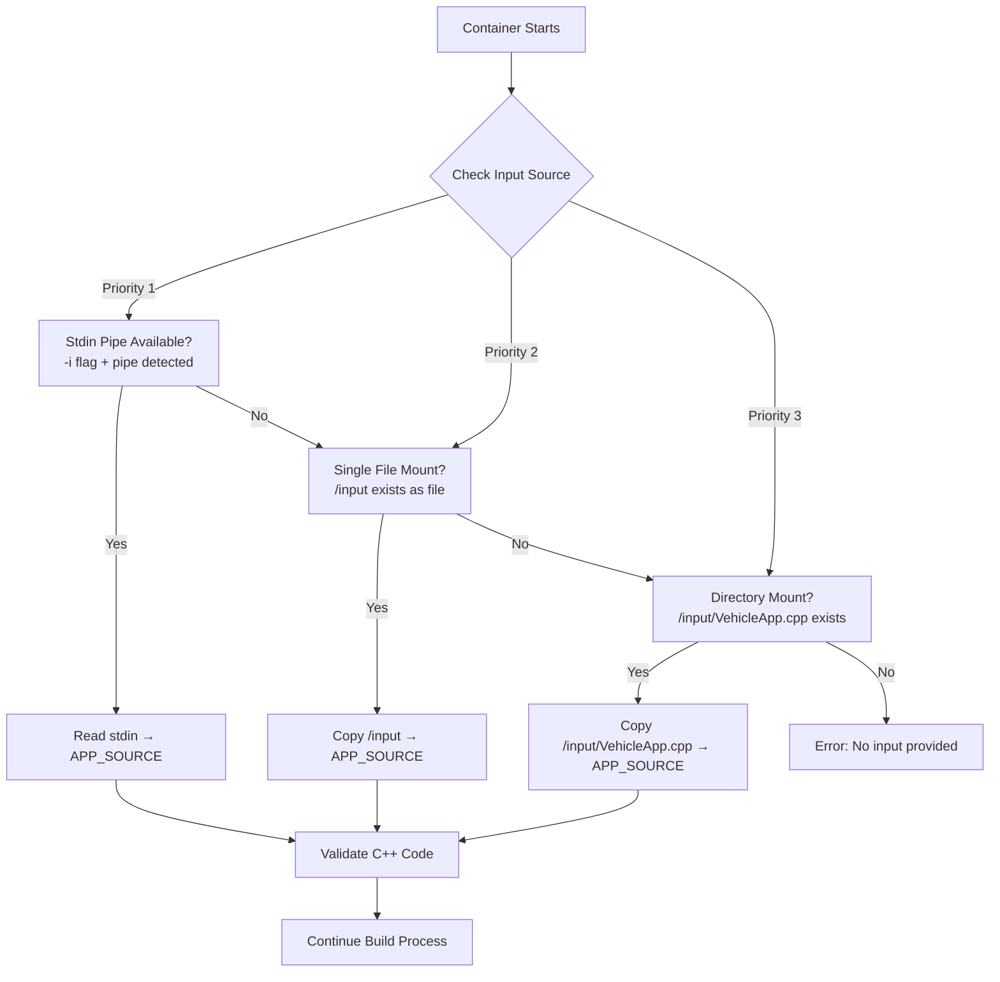
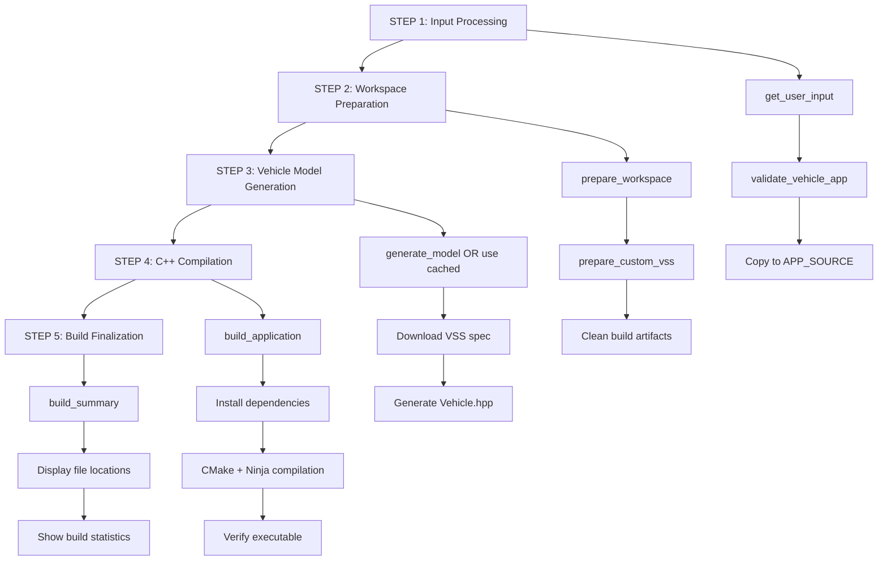
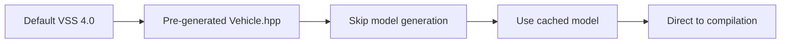
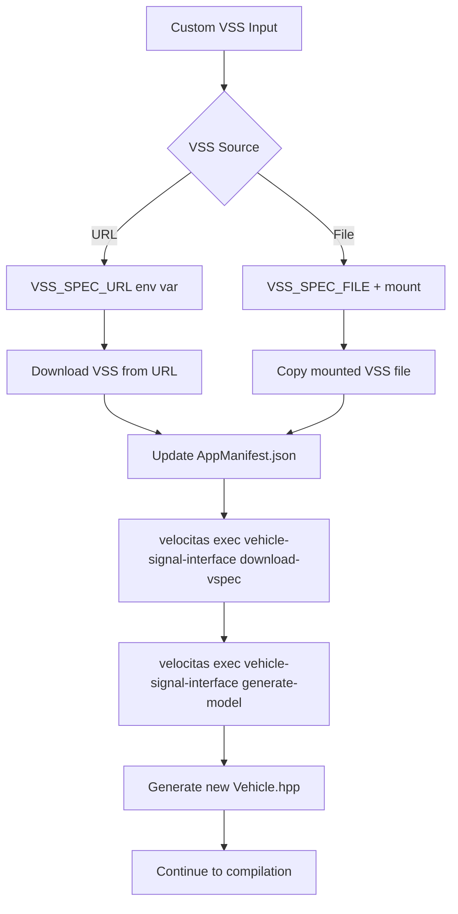
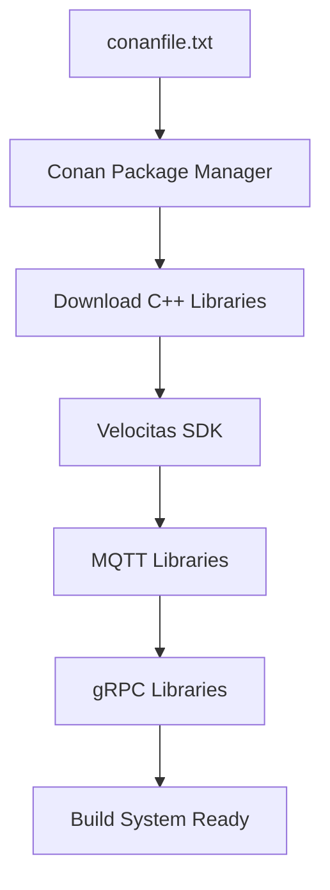
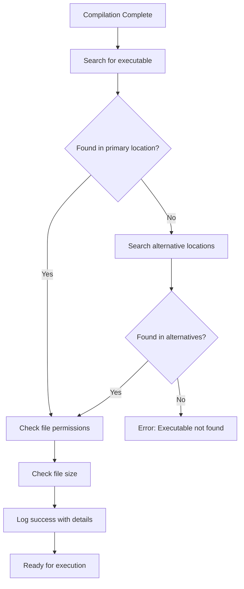
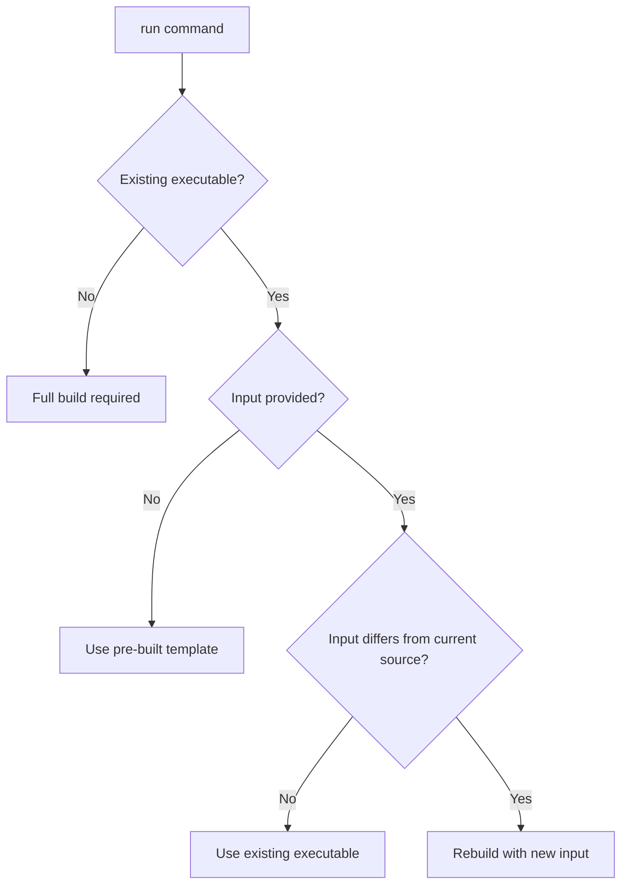

# 🔄 Build File Flow & Architecture

This document explains how files flow through the velocitas-quick build system, from input to executable, helping developers understand the build process internals.

## 📋 Table of Contents

- [Input Processing Flow](#input-processing-flow)
- [Build Stage Architecture](#build-stage-architecture)
- [File Locations & Mappings](#file-locations--mappings)
- [VSS Processing Flow](#vss-processing-flow)
- [Dependencies & Generated Files](#dependencies--generated-files)
- [Build Commands Deep Dive](#build-commands-deep-dive)

---

## 🔄 Input Processing Flow

### Mount Mode Processing (3 Methods)

```bash
# Method 1: Single File Mount
docker run -v $(pwd)/VehicleApp.cpp:/input velocitas-quick
# Container checks: /input (file) → copy to /quickbuild/app/src/VehicleApp.cpp

# Method 2: Directory Mount  
docker run -v $(pwd)/src:/input velocitas-quick
# Container checks: /input/VehicleApp.cpp → copy to /quickbuild/app/src/VehicleApp.cpp

# Method 3: Stdin Pipe
cat VehicleApp.cpp | docker run -i velocitas-quick
# Container checks: /dev/stdin (pipe) → read to /quickbuild/app/src/VehicleApp.cpp
```

### Input Processing Priority



**Key Variables:**
- `APP_SOURCE="/quickbuild/app/src/VehicleApp.cpp"` (target location)
- Mount point is always `/input` inside container
- Validation checks for VehicleApp class definition

---

## 🏗️ Build Stage Architecture

### Complete Build Flow (5 Steps)



### Granular Commands Support

```bash
# Individual step execution
docker run --rm velocitas-quick gen-model   # Step 3 only
docker run --rm velocitas-quick compile     # Step 4 only  
docker run --rm velocitas-quick finalize    # Step 5 only

# Command aliases
docker run --rm velocitas-quick model       # alias for gen-model
docker run --rm velocitas-quick build-cpp   # alias for compile
```

---

## 📁 File Locations & Mappings

### Container File System Layout

```
/quickbuild/                              # Main workspace
├── app/                                  # Application directory
│   ├── AppManifest.json                 # VSS configuration (copied from template)
│   ├── CMakeLists.txt                   # Build config (copied from template)
│   ├── src/
│   │   └── VehicleApp.cpp               # YOUR CODE (input processed here)
│   └── vehicle_model/                   # Generated C++ model files
│       └── include/vehicle_model/
│           └── Vehicle.hpp              # Generated from VSS
├── conanfile.txt                        # C++ dependencies (copied from template)
├── .velocitas.json                      # Framework config (copied from template)
├── build/                               # Build output directory
│   └── bin/
│       └── app                          # FINAL EXECUTABLE
└── custom-vss.json                      # Custom VSS (if provided)
```

### Template Source Locations (in container)

```
# Fixed template files (copied during container build)
/quickbuild/templates/AppManifest.json → /quickbuild/app/AppManifest.json
/quickbuild/templates/conanfile.txt → /quickbuild/conanfile.txt  
/quickbuild/templates/CMakeLists.txt → /quickbuild/CMakeLists.txt
/quickbuild/templates/app/ → /quickbuild/app/

# Pre-built components (available immediately)
/home/vscode/.local/bin/velocitas         # Velocitas CLI tools
/quickbuild/app/vehicle_model/            # Pre-generated model (default VSS)
/quickbuild/build/bin/app                 # Pre-built template executable
```

### External Mount Points

```bash
# Input mounts
-v $(pwd)/VehicleApp.cpp:/input          # Single file → /input
-v $(pwd)/src:/input                     # Directory → /input/
-v $(pwd)/custom.json:/vss.json          # Custom VSS → /vss.json

# Output mounts (optional)
-v $(pwd)/output:/quickbuild/build       # Extract build artifacts
-v cache-vol:/quickbuild/build           # Persistent build cache
```

---

## 🔧 VSS Processing Flow

### Default VSS Flow (Fast Path)



**Files Involved:**
- Pre-installed VSS 4.0 specification
- Pre-generated `/quickbuild/app/vehicle_model/include/vehicle_model/Vehicle.hpp`
- Time saved: ~30-60 seconds

### Custom VSS Flow (Full Generation)



**Environment Variables:**
```bash
VSS_SPEC_URL=https://company.com/vss.json    # Remote VSS specification
VSS_SPEC_FILE=/vss.json                      # Local VSS file path
```

**AppManifest.json Update:**
```json
{
  "interfaces": [{
    "type": "vehicle-signal-interface", 
    "config": {
      "src": "https://company.com/vss.json"  # Updated dynamically
    }
  }]
}
```

---

## 📦 Dependencies & Generated Files

### Dependency Installation Flow



**Key Dependencies (from conanfile.txt):**
- `boost/1.82.0` - Core utilities
- `cli11/2.3.2` - Command line parsing
- `fmt/10.0.0` - String formatting
- `nlohmann_json/3.11.2` - JSON handling
- `mqtt-cpp/13.2.1` - MQTT communication

### Generated Files Timeline

```
Container Build Time:
├── Pre-install dependencies (Conan packages)
├── Pre-generate Vehicle.hpp (default VSS)
└── Pre-build template app

Runtime (Your Code):
├── Copy your VehicleApp.cpp → /quickbuild/app/src/
├── [Optional] Generate new Vehicle.hpp (custom VSS)
├── CMake configuration
├── Ninja compilation
└── Final executable: /quickbuild/build/bin/app
```

---

## 🛠️ Build Commands Deep Dive

### Main Build Command Flow

```bash
# Entry point: /scripts/quick-build.sh
case "${1:-build}" in
    "build")     → main()           # Full 5-step build
    "run")       → quick-run.sh     # Build + run with services
    "rerun")     → quick-run.sh     # Run pre-built template
    "validate")  → validate only    # Code validation only
    "gen-model") → step_model()     # Step 3: Model generation
    "compile")   → step_compile()   # Step 4: Compilation  
    "finalize")  → step_finalize()  # Step 5: Summary
esac
```

### Individual Step Functions

#### Step 3: Model Generation (`gen-model`)
```bash
step_model() {
    prepare_workspace    # Set up VSS configuration
    generate_model      # Download VSS + generate Vehicle.hpp
}
```

**Velocitas Commands:**
```bash
velocitas exec vehicle-signal-interface download-vspec  # Download VSS spec
velocitas exec vehicle-signal-interface generate-model  # Generate C++ model
```

#### Step 4: Compilation (`compile`)
```bash
step_compile() {
    get_user_input      # Process your VehicleApp.cpp
    build_application   # Full C++ compilation
}
```

**Velocitas Commands:**
```bash
velocitas exec build-system install  # Install dependencies (if needed)
velocitas exec build-system build -r # Release mode compilation
```

#### Step 5: Finalization (`finalize`)
```bash
step_finalize() {
    build_summary       # Display file locations and statistics
}
```

### Build System Integration

**CMake Configuration:**
- Source files: `/quickbuild/app/src/*.cpp`
- Include paths: `/quickbuild/app/vehicle_model/include`
- Dependencies: Managed by Conan
- Output: `/quickbuild/build/bin/app`

**Ninja Build:**
- Parallel compilation
- Optimized for release builds (`-r` flag)
- Caching for faster rebuilds

---

## 🔍 Executable Verification

### Executable Search Locations

```bash
# Build system checks multiple possible locations:
/quickbuild/build/bin/app                          # Primary location
/quickbuild/build-linux-x86_64/Release/bin/app     # Alternative location
/quickbuild/app/build/bin/app                      # Legacy location
```

### Build Verification Steps



**Success Output:**
```
✅ [SUCCESS] Build completed successfully!
📍 Executable location: /quickbuild/build/bin/app
📏 Executable size: 14.2MB
🔐 Permissions: -rwxr-xr-x
```

---

## 🚀 Performance Optimizations

### Pre-built Optimizations

1. **Pre-installed Dependencies:** Conan packages cached in container
2. **Pre-generated Model:** Default VSS 4.0 model ready immediately  
3. **Pre-built Template:** Template app executable available for instant demo

### Smart Rebuild Detection (run command)

```bash
# Checks if rebuild needed:
- Compare input with existing /quickbuild/app/src/VehicleApp.cpp
- If identical: Skip build, use existing executable
- If different: Trigger rebuild with new code
- No input provided: Use pre-built template
```

### File Change Detection Logic



---

This build flow documentation helps developers understand exactly how their code travels through the velocitas-quick system, from input processing to final executable generation.