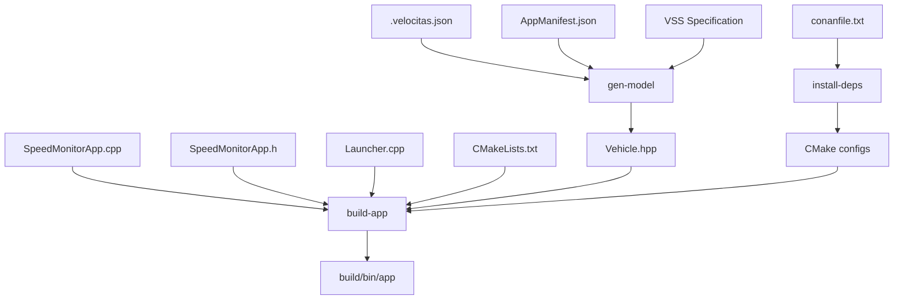

# Vehicle App Build Process & File Flow

This document explains the complete build process for the Speed Monitor vehicle application, showing how files flow through the build system from source to executable.

## 📁 File Categories

### 1. **Source Files** (Input)
```
app/src/
├── SpeedMonitorApp.cpp      # Main application logic
├── SpeedMonitorApp.h        # Application header with class definitions
└── Launcher.cpp             # Entry point with main() function
```

### 2. **Configuration Files** (Input)
```
./
├── CMakeLists.txt           # Root build configuration
├── CMakeUserPresets.json    # CMake build presets
├── conanfile.txt           # C++ dependency specifications
├── requirements.txt        # Python tool dependencies
├── .velocitas.json         # Velocitas framework configuration
└── AppManifest.json        # Vehicle signals and MQTT topics
```

### 3. **Generated Files** (Intermediate)
```
~/.velocitas/projects/<hash>/vehicle_model/include/
└── vehicle/Vehicle.hpp      # Generated vehicle signal classes

build-linux-x86_64/Debug/
├── generators/             # Conan dependency configurations
├── compile_commands.json   # Compilation database
└── build.ninja            # Ninja build file
```

### 4. **Build Artifacts** (Output)
```
build-linux-x86_64/Debug/
├── bin/app                 # Final executable
├── app/src/CMakeFiles/app.dir/
│   ├── SpeedMonitorApp.cpp.o
│   ├── Launcher.cpp.o      # Compiled object files
│   └── build.log
└── lib/                    # Static libraries (GoogleTest, etc.)
```

## 🔄 Build Process Flow

### Phase 1: Environment Setup
```
┌─────────────────┐    ┌─────────────────┐    ┌─────────────────┐
│  requirements.txt│───→│    pip install  │───→│Python tools ready│
└─────────────────┘    └─────────────────┘    └─────────────────┘
                                                        │
┌─────────────────┐    ┌─────────────────┐             ▼
│  .velocitas.json│───→│ velocitas init  │───→┌─────────────────┐
└─────────────────┘    └─────────────────┘    │Velocitas SDK setup│
                                              └─────────────────┘
```

### Phase 2: Vehicle Model Generation (`gen-model`)
```
┌─────────────────┐    ┌─────────────────┐    ┌─────────────────┐
│VSS spec (remote)│───→│velocitas exec   │───→│  Vehicle.hpp    │
│   vss_rel_4.0   │    │vehicle-signal-  │    │Vehicle.Speed    │
│     .json       │    │interface        │    │Vehicle.Accel... │
└─────────────────┘    └─────────────────┘    └─────────────────┘
Note: For custom VSS signals, change "src" in app/AppManifest.json to local file path
                                                        │
                       ┌─────────────────┐             ▼
                       │ C++ code        │    ┌─────────────────┐
                       │ generator       │◄───│Generated classes│
                       └─────────────────┘    │accessible in app│
                                              └─────────────────┘
```

### Phase 3: Dependency Installation (`install-deps`)
```
┌─────────────────┐    ┌─────────────────┐    ┌─────────────────┐
│  conanfile.txt  │───→│   conan install │───→│    ~/.conan2/   │
│                 │    │                 │    │                 │
│ velocitas-sdk   │    │ Download & build│    │ Compiled libs:  │
│ fmt             │    │ dependencies    │    │ - Velocitas SDK │
│ nlohmann_json   │    │                 │    │ - fmt           │
│ gRPC            │    │                 │    │ - nlohmann_json │
│ ...             │    │                 │    │ - gRPC          │
└─────────────────┘    └─────────────────┘    └─────────────────┘
                                                        │
                                                        ▼
                       ┌─────────────────┐    ┌─────────────────┐
                       │build/generators/│◄───│CMake config files│
                       │*.cmake files    │    │for linking      │
                       └─────────────────┘    └─────────────────┘
```

### Phase 4: Application Build (`build-app`)
```
┌─────────────────┐    ┌─────────────────┐    ┌─────────────────┐
│  CMakeLists.txt │───→│   cmake config  │───→│   build.ninja   │
└─────────────────┘    └─────────────────┘    └─────────────────┘
                                                        │
┌─────────────────┐    ┌─────────────────┐             ▼
│AppManifest.json │───→│Signal validation│    ┌─────────────────┐
└─────────────────┘    └─────────────────┘    │Build system ready│
                                              └─────────────────┘
                                                        │
┌─────────────────┐    ┌─────────────────┐             ▼
│SpeedMonitorApp  │───→│     g++ -c      │───→┌─────────────────┐
│    .cpp/.h      │    │   compilation   │    │   .o files      │
└─────────────────┘    └─────────────────┘    └─────────────────┘
                                                        │
┌─────────────────┐    ┌─────────────────┐             ▼
│  Launcher.cpp   │───→│     g++ -c      │───→┌─────────────────┐
└─────────────────┘    └─────────────────┘    │ Launcher.cpp.o  │
                                              └─────────────────┘
                                                        │
┌─────────────────┐    ┌─────────────────┐             ▼
│Generated Vehicle│───→│    Linking      │    ┌─────────────────┐
│ model classes   │    │   g++ linker    │◄───│Final executable │
│Conan libraries  │    │                 │    │ build/bin/app   │
│System libraries │    │                 │    └─────────────────┘
└─────────────────┘    └─────────────────┘
```

## 📊 Detailed File Dependencies

### Input Dependencies


### Build Outputs by Command

#### `gen-model` produces:
```
~/.velocitas/projects/<hash>/vehicle_model/
├── include/vehicle/Vehicle.hpp
├── CMakeLists.txt
└── conanfile.py
```

#### `install-deps` produces:
```
~/.conan2/
├── p/<package-hash>/           # Installed packages
build-linux-x86_64/Debug/generators/
├── conan_toolchain.cmake       # CMake toolchain
├── conanbuild.sh              # Build environment
├── *-config.cmake             # Package configurations
└── *Targets.cmake             # Link targets
```

#### `build-app` produces:
```
build-linux-x86_64/Debug/
├── bin/app                    # ← Final executable
├── compile_commands.json      # For IDE integration
├── build.ninja               # Build system
├── app/src/CMakeFiles/app.dir/
│   ├── SpeedMonitorApp.cpp.o  # Compiled objects
│   └── Launcher.cpp.o
└── CMakeCache.txt            # CMake cache
```

## 🔗 Library Linking Chain

The final executable links against:

### 1. **Vehicle Model** (Generated)
```
Vehicle.hpp classes → Embedded in executable
```

### 2. **Velocitas SDK** (Conan package)
```
VehicleApp base class
DataPointReply handling
MQTT client integration
Vehicle Data Broker client
```

### 3. **Third-party Libraries** (Conan packages)
```
fmt               → String formatting
nlohmann_json     → JSON parsing
gRPC              → Protocol communication
Protobuf          → Message serialization
OpenSSL           → Secure communication
```

### 4. **System Libraries** (OS provided)
```
libpthread        → Threading
libm              → Math functions
libc              → Standard C library
libstdc++         → C++ standard library
```

## 🚀 Runtime Dependencies

When `run-app` executes, it requires:

### External Services (via Docker Compose)
```
MQTT Broker       → localhost:1883
Vehicle Data Broker → localhost:55555
```

### Environment Variables
```
SDV_MQTT_ADDRESS=127.0.0.1:1883
SDV_VEHICLEDATABROKER_ADDRESS=127.0.0.1:55555
SDV_MIDDLEWARE_TYPE=native
```

### Configuration Files
```
AppManifest.json  → Vehicle signals specification
                  → MQTT topic definitions
```

## 🔧 Build Commands Breakdown

### `gen-model`
```bash
# What it does:
velocitas exec vehicle-signal-interface download-vspec
velocitas exec vehicle-signal-interface generate-model

# Input:  VSS specification (JSON)
# Output: C++ classes in Vehicle.hpp
# Used by: SpeedMonitorApp.cpp (includes Vehicle.hpp)
```

### `install-deps`
```bash
# What it does:
velocitas exec build-system install

# Input:  conanfile.txt
# Output: CMake configurations + compiled libraries
# Used by: build-app (CMake needs these configurations)
```

### `build-app`
```bash
# What it does:
velocitas exec build-system build

# Input:  C++ source files + CMake configs + libraries
# Output: Executable binary (build/bin/app)
# Used by: run-app (executes this binary)
```

### `run-app`
```bash
# What it does:
velocitas exec runtime-local run-vehicle-app /workspace/build/bin/app

# Input:  build/bin/app + external services
# Output: Running vehicle application with logs
# Connects to: MQTT broker + Vehicle Data Broker
```

## 📈 Build Performance Notes

### Incremental Builds
- **Only changed `.cpp` files** are recompiled
- **Header changes** trigger recompilation of dependent files
- **CMake configuration changes** trigger full reconfiguration
- **Conan dependencies** are cached until `conanfile.txt` changes

### Clean Builds
```bash
# Force clean rebuild
rm -rf build-linux-x86_64/
install-deps && build-app
```

### Build Optimization
- **Debug builds** (`build-app`): Include debugging symbols, no optimization
- **Release builds** (`build-app -r`): Optimized for performance, smaller size

This build process ensures a reliable, reproducible development environment for vehicle applications! 🎉