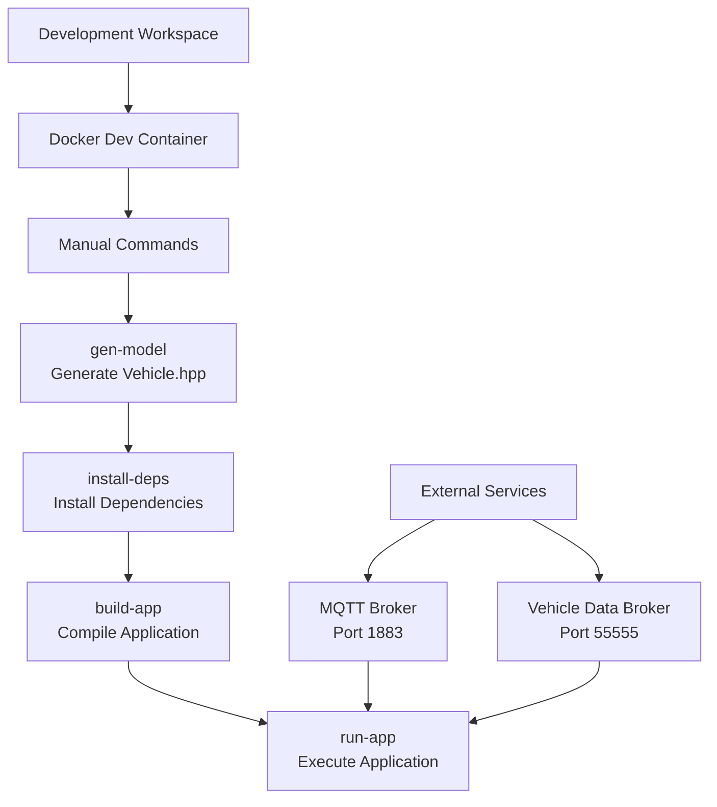

# 🚗 Developer Workflow Guide - Vehicle App Development

This document explains the complete workflow for developing C++ vehicle applications using this repository, from input files to final executables.

## 📋 Table of Contents

- [Overview](#overview)
- [Repository Structure](#repository-structure)
- [Development Workflows](#development-workflows)
- [Input/Output Flow Diagrams](#inputoutput-flow-diagrams)
- [File Dependencies](#file-dependencies)
- [Customization Points](#customization-points)
- [Troubleshooting](#troubleshooting)

---

## 🎯 Overview

This repository provides **two main approaches** for developing Velocitas C++ vehicle applications:

1. **🚀 Quick Build Utility** (Recommended) - Zero-setup containerized building
2. **🛠️ Traditional Development** (Optional) - Full development environment

Both approaches use the same underlying technologies but offer different developer experiences.

---

## 📁 Repository Structure

```
vehicle-app-cpp-template/
├── 🚀 Quick Build Utility (Main Workflow)
│   ├── Dockerfile.quick                    # Container definition
│   ├── scripts/quick-build.sh              # Main build orchestrator
│   ├── scripts/quick-run.sh                # Build & run helper
│   ├── scripts/validate-template.sh        # Code validation
│   └── templates/                          # Fixed configurations + template
│       ├── AppManifest.json                # VSS configuration
│       ├── conanfile.txt                   # C++ dependencies
│       ├── CMakeLists.txt                  # Build configuration
│       └── app/src/VehicleApp.template.cpp # Instructional template
│
├── 🧪 Testing & Validation
│   ├── test-mode2.sh                       # Automated test suite
│   └── test_results/                       # Test output logs
│
├── 🛠️ Traditional Development (Optional)
│   ├── Dockerfile.dev                      # Full dev container
│   ├── docker-compose.dev.yml              # Complete stack
│   └── config/mosquitto.conf               # MQTT broker config
│
├── 📚 Documentation & Examples
│   ├── archived/                           # Legacy files + working example
│   │   └── app/src/VehicleApp.cpp          # Working reference implementation
│   ├── README.md                           # Main documentation
│   └── DEVELOPER_WORKFLOW.md               # This file
│
└── 🔧 Configuration Files
    ├── .velocitas.json                     # Velocitas framework config
    ├── requirements.txt                    # Python dependencies
    └── .gitignore                          # Git ignore rules
```

---

## 🔄 Development Workflows

### 🚀 Workflow 1: Quick Build Utility (Recommended)

**Perfect for**: Production builds, CI/CD, corporate environments, rapid prototyping

#### **Input Requirements:**
- `VehicleApp.cpp` file (your vehicle application code)
- Optional: Custom VSS specification file or URL
- Optional: Proxy configuration for corporate networks

#### **Process Flow:**

```mermaid
graph TD
    A[Your VehicleApp.cpp] --> B[Docker Container<br/>velocitas-quick]
    B --> C{Input Method}
    C -->|stdin| D[cat VehicleApp.cpp | docker run]
    C -->|file mount| E[docker run -v file:/input]
    C -->|directory mount| F[docker run -v dir:/input]
    
    D --> G[quick-build.sh]
    E --> G
    F --> G
    
    G --> H[Validate Code]
    H --> I{VSS Custom?}
    I -->|No| J[Use Default VSS 4.0]
    I -->|Yes| K[Download Custom VSS<br/>Update AppManifest.json]
    
    J --> L[Use Pre-generated Model]
    K --> M[Generate New Vehicle Model]
    
    L --> N[Build C++ App]
    M --> N
    N --> O[Optimized Executable]
```

#### **Command Examples:**

```bash
# Basic build (uses default VSS 4.0)
cat templates/app/src/VehicleApp.template.cpp | docker run --rm -i velocitas-quick

# With custom VSS URL
docker run --rm -i \
  -e VSS_SPEC_URL=https://company.com/vss.json \
  velocitas-quick < YourVehicleApp.cpp

# With custom VSS file
docker run --rm -i \
  -v $(pwd)/custom-vss.json:/vss.json \
  -e VSS_SPEC_FILE=/vss.json \
  velocitas-quick < YourVehicleApp.cpp

# With corporate proxy
docker run --rm -i \
  -e HTTP_PROXY=http://proxy:3128 \
  -e HTTPS_PROXY=http://proxy:3128 \
  velocitas-quick < YourVehicleApp.cpp

# File mount method
docker run --rm -v $(pwd)/YourVehicleApp.cpp:/input velocitas-quick

# Directory mount method (looks for VehicleApp.cpp in directory)
docker run --rm -v $(pwd)/src:/input velocitas-quick

# Validation only (no build)
cat YourVehicleApp.cpp | docker run --rm -i velocitas-quick validate
```

#### **Output:**
- **Primary**: Optimized C++ executable (`/quickbuild/build/bin/app`)
- **Logs**: Build logs with detailed progress information
- **Size**: ~13-15MB optimized binary
- **Time**: 60-90 seconds (default VSS) or 90-120 seconds (custom VSS)

---

### 🛠️ Workflow 2: Traditional Development (Optional)

**Perfect for**: Learning, debugging, complex development, educational purposes

#### **Input Requirements:**
- Full workspace directory structure
- Source code in `app/src/VehicleApp.cpp`
- Manual configuration of VSS and dependencies

#### **Process Flow:**



#### **Command Examples:**

```bash
# Setup development environment
docker build -f Dockerfile.dev -t velocitas-dev .
docker compose -f docker-compose.dev.yml up mosquitto vehicledatabroker -d

# Enter development container
docker run -it --privileged -v $(pwd):/workspace --network=host velocitas-dev

# Inside container - development cycle
gen-model      # Generate Vehicle.hpp from VSS
install-deps   # Install Velocitas SDK and dependencies
build-app      # Compile C++ application
run-app        # Run the vehicle application

# Development utilities
check-code     # Run linting and formatting
./build/bin/app_utests  # Execute unit tests
vdb-cli        # Vehicle Data Broker CLI
```

#### **Output:**
- **Primary**: Debug executable with symbols
- **Secondary**: Unit test binaries, development tools
- **Logs**: Detailed build and runtime logs
- **Interactive**: Live debugging, code modification

---

## 📊 Input/Output Flow Diagrams

### Default VSS Flow (Quick Build)

```
Input: VehicleApp.cpp
   ↓
┌─────────────────────────────────────┐
│ Docker Container: velocitas-quick   │
│ ┌─────────────────────────────────┐ │
│ │ 1. Validate VehicleApp.cpp     │ │
│ │ 2. Copy to /quickbuild/app/src/ │ │
│ │ 3. Use pre-installed deps      │ │
│ │ 4. Use pre-generated model     │ │
│ │ 5. Build with CMake/Ninja      │ │
│ └─────────────────────────────────┘ │
└─────────────────────────────────────┘
   ↓
Output: Executable (/quickbuild/build/bin/app)
Time: ~60-90 seconds
```

### Custom VSS Flow (Quick Build)

```
Input: VehicleApp.cpp + VSS_SPEC_URL
   ↓
┌─────────────────────────────────────┐
│ Docker Container: velocitas-quick   │
│ ┌─────────────────────────────────┐ │
│ │ 1. Validate VehicleApp.cpp     │ │
│ │ 2. Download custom VSS spec    │ │
│ │ 3. Update AppManifest.json     │ │
│ │ 4. Generate new Vehicle.hpp    │ │
│ │ 5. Install dependencies        │ │
│ │ 6. Build with CMake/Ninja      │ │
│ └─────────────────────────────────┘ │
└─────────────────────────────────────┘
   ↓
Output: Executable with custom signals
Time: ~90-120 seconds
```

### Traditional Development Flow

```
Input: Full Workspace
   ↓
┌─────────────────────────────────────┐
│ Development Container               │
│ ┌─────────────────────────────────┐ │
│ │ Manual Steps:                   │ │
│ │ 1. gen-model                    │ │
│ │ 2. install-deps                 │ │
│ │ 3. build-app                    │ │
│ │ 4. run-app                      │ │
│ └─────────────────────────────────┘ │
└─────────────────────────────────────┘
   ↓
Output: Debug executable + dev tools
Time: Variable (manual control)
```

---

## 🔗 File Dependencies

### Core Dependencies Graph

```
VehicleApp.cpp (Your Code)
   ↓
AppManifest.json (VSS Configuration)
   ↓
Vehicle Signal Specification (VSS)
   ↓
Generated Vehicle.hpp (C++ Model)
   ↓
Velocitas SDK (Vehicle Framework)
   ↓
Final Executable
```

### Detailed File Relationships

| File | Purpose | Dependencies | Generated By |
|------|---------|--------------|--------------|
| `VehicleApp.cpp` | Your application logic | `Vehicle.hpp`, Velocitas SDK | **You (Developer)** |
| `AppManifest.json` | VSS configuration, data points | VSS specification URL/file | Template (customizable) |
| `Vehicle.hpp` | C++ signal definitions | VSS specification | `velocitas exec vehicle-signal-interface generate-model` |
| `conanfile.txt` | C++ dependencies | Conan packages | Template (fixed) |
| `CMakeLists.txt` | Build configuration | Source files, dependencies | Template (fixed) |
| `.velocitas.json` | Framework configuration | Velocitas components | Template (fixed) |

### VSS Specification Sources

| VSS Source | Usage | Update Method |
|------------|-------|---------------|
| **Default VSS 4.0** | Standard vehicle signals | Pre-installed in container |
| **Custom VSS URL** | Company-specific signals | `VSS_SPEC_URL` environment variable |
| **Custom VSS File** | Local signal definitions | `VSS_SPEC_FILE` + file mount |

---

## 🎛️ Customization Points

### 1. **Vehicle Signals (Primary Customization)**

**File**: `VehicleApp.cpp`
**Location**: `onStart()` and `onSignalChanged()` methods

```cpp
// Choose signals in onStart()
subscribeDataPoints(velocitas::QueryBuilder::select(Vehicle.Speed)
                                           .select(Vehicle.Cabin.HVAC.Station.Row1.Left.Temperature)
                                           .build())

// Process signals in onSignalChanged()
auto speed = reply.get(Vehicle.Speed)->value();
auto temp = reply.get(Vehicle.Cabin.HVAC.Station.Row1.Left.Temperature)->value();
```

### 2. **VSS Specification (Secondary Customization)**

**Default Signals Available:**
- `Vehicle.Speed` - Vehicle speed in m/s
- `Vehicle.Cabin.HVAC.Station.Row1.Left.Temperature` - Cabin temperature
- `Vehicle.Powertrain.Engine.Speed` - Engine RPM
- `Vehicle.Powertrain.FuelSystem.Level` - Fuel level percentage
- `Vehicle.CurrentLocation.Latitude/Longitude` - GPS coordinates

**Custom VSS Methods:**
```bash
# Method 1: Custom VSS URL
-e VSS_SPEC_URL=https://company.com/signals.json

# Method 2: Custom VSS File
-v $(pwd)/custom-vss.json:/vss.json -e VSS_SPEC_FILE=/vss.json
```

### 3. **Build Configuration (Advanced)**

**Files**: `CMakeLists.txt`, `conanfile.txt`
**Use Cases**: Additional libraries, custom build flags, linking requirements

### 4. **Dependencies (Advanced)**

**File**: `conanfile.txt`
**Use Cases**: Additional C++ libraries, specific versions

---

## 🔧 Environment Variables

| Variable | Purpose | Example | Used In |
|----------|---------|---------|---------|
| `VSS_SPEC_URL` | Custom VSS specification URL | `https://company.com/vss.json` | Quick Build |
| `VSS_SPEC_FILE` | Custom VSS specification file path | `/vss.json` | Quick Build |
| `HTTP_PROXY` | HTTP proxy for corporate networks | `http://proxy:3128` | Both |
| `HTTPS_PROXY` | HTTPS proxy for corporate networks | `http://proxy:3128` | Both |
| `BUILD_TYPE` | Build configuration | `Debug`, `Release` | Quick Build |
| `CMAKE_FLAGS` | Additional CMake flags | `-DCUSTOM_FLAG=ON` | Quick Build |

---

## 🧪 Testing Your Workflow

### Automated Testing

```bash
# Test quick build utility (no proxy)
./test-mode2.sh

# Test with corporate proxy
./test-mode2.sh --proxy --proxy-host company-proxy:3128

# Test with custom settings
./test-mode2.sh --proxy --timeout 180 --output my_test_results
```

### Manual Testing

```bash
# Test template build
cat templates/app/src/VehicleApp.template.cpp | docker run --rm -i velocitas-quick

# Test validation only
echo 'invalid code' | docker run --rm -i velocitas-quick validate

# Test custom VSS
docker run --rm -i \
  -e VSS_SPEC_URL=https://raw.githubusercontent.com/COVESA/vehicle_signal_specification/main/spec/VehicleSignalSpecification.json \
  velocitas-quick < templates/app/src/VehicleApp.template.cpp
```

---

## 🚨 Troubleshooting

### Common Issues and Solutions

#### Build Fails
```bash
# Check code validation first
cat YourVehicleApp.cpp | docker run --rm -i velocitas-quick validate

# Rebuild container if needed
docker build --no-cache -f Dockerfile.quick -t velocitas-quick .
```

#### Proxy Issues
```bash
# Test proxy connectivity
docker run --rm -e HTTP_PROXY=http://proxy:3128 alpine wget -q --spider http://github.com

# Verify proxy environment variables
docker run --rm velocitas-quick env | grep -i proxy
```

#### VSS Specification Errors
```bash
# Verify VSS URL is accessible
curl -s $VSS_SPEC_URL | jq . > /dev/null && echo "VSS OK" || echo "VSS Failed"

# Use default VSS as fallback
docker run --rm -i velocitas-quick < YourVehicleApp.cpp  # Uses VSS 4.0 default
```

#### Permission Problems
```bash
# Fix file permissions
docker run --rm -v $(pwd):/workspace --privileged velocitas-quick \
  bash -c "chown -R $(id -u):$(id -g) /workspace"
```

#### Container Size Issues
```bash
# Clean Docker cache
docker system prune -f

# Remove old images
docker rmi $(docker images -f "dangling=true" -q)
```

---

## 📈 Performance Optimization

### Build Time Optimization

| Approach | Time Savings | Method |
|----------|--------------|--------|
| **Pre-built Container** | ~3-5 minutes | `docker pull your-registry/velocitas-quick:latest` |
| **Default VSS** | ~30-60 seconds | Don't use custom VSS unless needed |
| **Cached Dependencies** | ~2-3 minutes | Pre-installed in container |
| **Parallel Testing** | ~50% | Run multiple test cases simultaneously |

### CI/CD Integration

```yaml
# GitHub Actions Example
- name: Build Vehicle App
  run: |
    docker build -f Dockerfile.quick -t builder .
    cat src/VehicleApp.cpp | docker run --rm -i \
      -e VSS_SPEC_URL=${{ secrets.COMPANY_VSS_URL }} \
      builder > app-executable

# Jenkins Pipeline Example
pipeline {
    agent any
    steps {
        script {
            sh '''
                docker build -f Dockerfile.quick -t velocitas-quick .
                docker run --rm -v ${WORKSPACE}/src:/input velocitas-quick
            '''
        }
    }
}
```

---

## 🎯 Best Practices

### Development Workflow
1. **Start with Template**: Use `templates/app/src/VehicleApp.template.cpp` as learning base
2. **Iterative Development**: Build → Test → Modify → Repeat
3. **Validation First**: Always validate code before full build
4. **Default VSS First**: Start with default signals, customize later

### Production Deployment
1. **Pre-build Containers**: Build once, use everywhere
2. **Custom VSS**: Use company-specific signal specifications
3. **Proxy Configuration**: Configure for corporate networks
4. **Automated Testing**: Use test suite in CI/CD pipelines

### Code Organization
1. **Signal Selection**: Group related signals together
2. **Error Handling**: Always handle signal availability checks
3. **Logging**: Use structured logging for debugging
4. **Performance**: Monitor processing time for signal handlers

---

## 📚 Additional Resources

- **[Velocitas Documentation](https://eclipse-velocitas.github.io/velocitas-docs/)** - Framework documentation
- **[Vehicle Signal Specification](https://covesa.github.io/vehicle_signal_specification/)** - VSS reference
- **[KUKSA.val](https://github.com/eclipse/kuksa.val)** - Vehicle Data Broker
- **[Eclipse Velocitas GitHub](https://github.com/eclipse-velocitas)** - Source code and examples

---

**Happy Vehicle App Development! 🚗💨**

*This workflow guide helps you understand the complete development process from input files to final executables, enabling efficient C++ vehicle application development.*