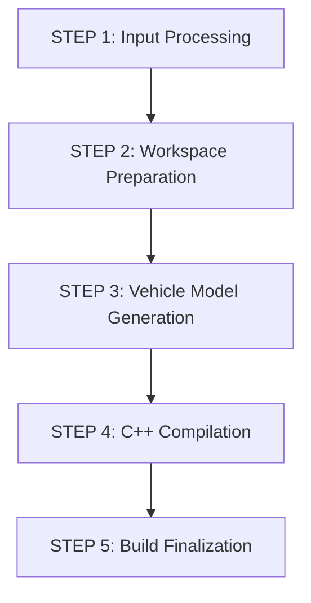

# Velocitas C++ Vehicle App Template

[](http://www.apache.org/licenses/LICENSE-2.0)
[](https://docker.com)
[](https://github.com/eclipse-velocitas/velocitas-docs)

🚀 **Complete Software-Defined Vehicle development template** with zero-setup Docker utility for building [Eclipse Velocitas](https://github.com/eclipse-velocitas/velocitas-docs) vehicle applications in C++. Enhanced with unified CLI, signal processing validation, corporate proxy support, and comprehensive learning examples.

> **Based on [Eclipse Velocitas Vehicle App Template](https://github.com/eclipse-velocitas/vehicle-app-cpp-template)** - Enhanced for instant containerized building without local development environment setup.

## 🎯 **THE GOAL: Prove We Have a Working Vehicle App**

**Primary Objective:** Demonstrate that the enhanced build system produces a functional vehicle app that:
- ✅ Builds successfully from source code
- ✅ Connects to KUKSA databroker  
- ✅ Subscribes to vehicle signals
- ✅ Processes and responds to signal changes
- ✅ Runs continuously and reliably

---

## ⚡ **Complete Working Flow: Build → Run → Signal → Success**

### **Step 1: Build Container with Proxy Support**
```bash
# Build the enhanced container (3-5 minutes)
docker build -f Dockerfile.quick \
  --build-arg HTTP_PROXY=http://127.0.0.1:3128 \
  --build-arg HTTPS_PROXY=http://127.0.0.1:3128 \
  --network=host \
  -t velocitas-quick .
```

### **Step 2: Start KUKSA Databroker**
```bash
# Option A: Using docker-compose (recommended)
docker-compose -f docker-compose.dev.yml up vehicledatabroker -d

# Option B: Direct docker run
docker run -d --rm --name kuksa-databroker --network host \
  ghcr.io/eclipse-kuksa/kuksa-databroker:main
```

### **Step 3: Build Vehicle App with Performance Optimization**
```bash
# OPTIMIZED BUILD: Skip dependencies and VSS for faster builds (15-30 seconds)
docker run --rm --network host \
  -e SDV_VEHICLEDATABROKER_ADDRESS=127.0.0.1:55555 \
  -v $(pwd)/templates/app/src/VehicleApp.cpp:/app.cpp \
  -v $(pwd)/scripts/velocitas-cli.sh:/scripts/velocitas-cli.sh \
  velocitas-quick build --skip-deps --skip-vss --verbose

# OR Traditional build with full dependency resolution (60-90 seconds)
docker run --rm --network host \
  -e SDV_VEHICLEDATABROKER_ADDRESS=127.0.0.1:55555 \
  -v $(pwd)/templates/app/src/VehicleApp.cpp:/app.cpp \
  velocitas-quick build --verbose
```

### **Step 4: Run Vehicle Application**

#### **Option A: Build and Run in Same Container (Recommended for Development)**
```bash
docker run -d --network host --name vehicle-app \
  -e SDV_VEHICLEDATABROKER_ADDRESS=127.0.0.1:55555 \
  -e HTTP_PROXY= -e HTTPS_PROXY= -e http_proxy= -e https_proxy= \
  -v $(pwd)/templates/app/src/VehicleApp.cpp:/app.cpp \
  -v $(pwd)/scripts/velocitas-cli.sh:/scripts/velocitas-cli.sh \
  velocitas-quick bash -c "build --skip-deps --skip-vss && run 300"
```

#### **Option B: Separate Build/Run with Persistent Volumes (Production Workflow)**
```bash
# Step 1: Create persistent volumes (one-time setup)
docker volume create velocitas-build     # For executables and build artifacts
docker volume create velocitas-deps      # For dependencies and VSS models
docker volume create velocitas-conan     # For Conan package cache

# Step 2: Build with persistent volumes
docker run --rm --network host \
  -v velocitas-build:/quickbuild/build \
  -v velocitas-deps:/quickbuild/app/vehicle_model \
  -v velocitas-conan:/home/vscode/.conan2 \
  -e SDV_VEHICLEDATABROKER_ADDRESS=127.0.0.1:55555 \
  -v $(pwd)/templates/app/src/VehicleApp.cpp:/app.cpp \
  -v $(pwd)/scripts/velocitas-cli.sh:/scripts/velocitas-cli.sh \
  velocitas-quick build --verbose

# Step 3: Run with same persistent volumes (reusable)
docker run -d --network host --name vehicle-app \
  -v velocitas-build:/quickbuild/build \
  -v velocitas-deps:/quickbuild/app/vehicle_model \
  -v velocitas-conan:/home/vscode/.conan2 \
  -e SDV_VEHICLEDATABROKER_ADDRESS=127.0.0.1:55555 \
  -e HTTP_PROXY= -e HTTPS_PROXY= -e http_proxy= -e https_proxy= \
  velocitas-quick run 300

# Benefits: 
# - Build once, run multiple times with full dependency retention
# - Subsequent builds are much faster (dependencies cached)
# - True separation of build and run environments
```

### **Step 5: Inject Vehicle Signal & Verify**
```bash
# Inject speed signal to test subscription
echo "setValue Vehicle.Speed 65.0" | docker run --rm -i --network host \
  -e HTTP_PROXY= -e HTTPS_PROXY= -e http_proxy= -e https_proxy= \
  ghcr.io/eclipse-kuksa/kuksa-python-sdk/kuksa-client:main grpc://127.0.0.1:55555

# Check vehicle app received and processed the signal
docker logs vehicle-app --tail 20
```

**🎉 SUCCESS PROOF - Expected Result:**
```
INFO: 📊 Vehicle Speed: 65.00 m/s (234.0 km/h)
WARN: ⚠️  HIGH SPEED ALERT: 234.0 km/h - Slow down!
```

---

## 🎯 **Key Features**

✅ **Zero Dependencies** - No host installation required  
✅ **Lightning Fast** - Pre-compiled dependencies (15-30 seconds with optimization)  
✅ **File Mounting First** - Reliable file mounting instead of piping  
✅ **Unified CLI** - Single script for build, run, and test operations  
✅ **Enhanced Control** - Verbose logging, clean builds, skip flags  
✅ **Signal Testing** - Multi-container KUKSA validation  
✅ **Proxy Ready** - Full corporate network support  
✅ **VSS Flexible** - Use default VSS 4.0 or custom specifications  
✅ **SDV Examples** - Real automotive use case demonstrations  
✅ **Production Ready** - Optimized executable output  

---

## 🚀 **Enhanced Build System - Unified CLI**

The new unified CLI (`scripts/velocitas-cli.sh`) provides comprehensive control over the build process:

### **Core Commands**
```bash
# Build application (recommended: use --skip-deps for speed)
docker run -v $(pwd)/MyApp.cpp:/app.cpp velocitas-quick build --skip-deps --skip-vss --verbose

# Run application  
docker run -v $(pwd)/MyApp.cpp:/app.cpp velocitas-quick run [timeout]

# Test application with signal validation
docker run -v $(pwd)/MyApp.cpp:/app.cpp velocitas-quick test signal-validation

# Validate source code only
docker run -v $(pwd)/MyApp.cpp:/app.cpp velocitas-quick validate

# Clean build artifacts
docker run -v $(pwd)/MyApp.cpp:/app.cpp velocitas-quick clean

# Show help
docker run velocitas-quick help
```

### **Build Control Flags**
```bash
--verbose      # Show detailed build output
--clean        # Clean workspace before build  
--skip-deps    # Skip dependency installation (3-4x faster builds)
--skip-vss     # Skip VSS model generation
--force        # Force rebuild even if unchanged
--quiet        # Suppress non-essential output
```

### **Multi-Container Testing**
```bash
# Test signal injection and processing
docker run -v $(pwd)/MyApp.cpp:/app.cpp velocitas-quick test signal-validation

# Test build process
docker run -v $(pwd)/MyApp.cpp:/app.cpp velocitas-quick test build-validation

# Run complete test suite
docker run -v $(pwd)/MyApp.cpp:/app.cpp velocitas-quick test full-suite
```

---

## 📚 **Learning Templates & SDV Examples**

### **Step-by-Step Template (VehicleApp.cpp)**
New to Velocitas? Check out the comprehensive template with 50+ vehicle signal examples:
```bash
# View the step-by-step template
cat templates/app/src/VehicleApp.cpp

# Build and test the template
docker run -v $(pwd)/templates/app/src/VehicleApp.cpp:/app.cpp velocitas-quick build --verbose
```

**Template Features:**
- **50+ vehicle signal examples** with descriptions
- **Step-by-step signal subscription** guide  
- **Common use case patterns** (speed monitoring, fuel tracking, etc.)
- **VSS customization** instructions
- **Production-ready patterns** with error handling

### **SDV Fleet Management Example**
Complete real-world automotive use case:
```bash
# Try the comprehensive SDV Fleet Management example
cp examples/FleetManagementSDV.cpp templates/app/src/VehicleApp.cpp
docker run -v $(pwd)/templates/app/src/VehicleApp.cpp:/app.cpp velocitas-quick build --verbose
```

**Example Features:**
- **Multi-signal processing** (10 vehicle signals)
- **Real-time decision making**
- **Fleet management analytics**  
- **Predictive maintenance**
- **Driver behavior analysis**

---

## 🧪 **Complete Test Scenarios**

### **Test 1: Basic Speed Signal Processing**
```bash
# Test different speed values
echo "setValue Vehicle.Speed 5.0" | docker run --rm -i --network host ghcr.io/eclipse-kuksa/kuksa-python-sdk/kuksa-client:main grpc://127.0.0.1:55555
echo "setValue Vehicle.Speed 15.0" | docker run --rm -i --network host ghcr.io/eclipse-kuksa/kuksa-python-sdk/kuksa-client:main grpc://127.0.0.1:55555
echo "setValue Vehicle.Speed 25.0" | docker run --rm -i --network host ghcr.io/eclipse-kuksa/kuksa-python-sdk/kuksa-client:main grpc://127.0.0.1:55555
echo "setValue Vehicle.Speed 35.0" | docker run --rm -i --network host ghcr.io/eclipse-kuksa/kuksa-python-sdk/kuksa-client:main grpc://127.0.0.1:55555
```

**Expected Vehicle App Responses:**
```
INFO: 🚶 Very slow: 18.0 km/h                    # 5.0 m/s
INFO: 🏘️  City driving speed: 54.0 km/h         # 15.0 m/s  
INFO: 🚗 Normal highway speed: 90.0 km/h        # 25.0 m/s
WARN: ⚠️  HIGH SPEED ALERT: 126.0 km/h          # 35.0 m/s
```

### **Test 2: Testing with Live Services**
```bash
# 1. Start Vehicle Data Broker
docker-compose -f docker-compose.dev.yml up vehicledatabroker -d

# 2. Run your app with services
docker run -d --network host --name vehicle-app \
  -e SDV_VEHICLEDATABROKER_ADDRESS=127.0.0.1:55555 \
  -v $(pwd)/templates/app/src/VehicleApp.cpp:/app.cpp \
  velocitas-quick run 300

# 3. Test with KUKSA client (in another terminal)
docker run -it --rm --network=host ghcr.io/eclipse-kuksa/kuksa-python-sdk/kuksa-client:main
# Inside kuksa-client: setValue Vehicle.Speed 65.0

# 4. Stop services
docker-compose -f docker-compose.dev.yml down
```

---

## 🔧 **Proxy Support (Corporate Networks)**

### **Build with Proxy Support**
```bash
# Build with proxy support
docker build -f Dockerfile.quick \
  --build-arg HTTP_PROXY=http://127.0.0.1:3128 \
  --build-arg HTTPS_PROXY=http://127.0.0.1:3128 \
  --network=host \
  -t velocitas-quick .

# Use with runtime proxy
docker run --rm --network host \
  -e HTTP_PROXY=http://127.0.0.1:3128 \
  -e HTTPS_PROXY=http://127.0.0.1:3128 \
  -v $(pwd)/templates/app/src/VehicleApp.cpp:/app.cpp \
  velocitas-quick build --verbose
```

### **Corporate Integration Examples**
```bash
# Jenkins/CI Pipeline
docker run --rm \
  -v $BUILD_SOURCESDIRECTORY/src/VehicleApp.cpp:/app.cpp \
  -e HTTP_PROXY=$CORPORATE_PROXY \
  velocitas-quick build --skip-deps --verbose

# GitLab CI with custom VSS
docker run --rm \
  -v $(pwd)/src/VehicleApp.cpp:/app.cpp \
  -e VSS_SPEC_URL=$COMPANY_VSS_ENDPOINT \
  -e HTTP_PROXY=$CORPORATE_PROXY \
  velocitas-quick build --verbose
```

---

## 📁 **Project Structure**

```
vehicle-app-cpp-template/
├── 🚀 Enhanced Build System
│   ├── Dockerfile.quick             # Main utility container
│   ├── scripts/velocitas-cli.sh     # Unified CLI script
│   └── templates/                   # Fixed configurations & learning template
├── 🧪 Examples & Learning
│   ├── examples/FleetManagementSDV.cpp  # Comprehensive SDV example
│   └── templates/app/src/VehicleApp.cpp # Step-by-step learning template
├── 🔧 Configuration
│   ├── conanfile.txt               # C++ dependencies
│   ├── requirements.txt            # Python dependencies
│   └── .velocitas.json             # Velocitas configuration
├── 🛠️ Development Environment
│   ├── docker-compose.dev.yml      # Complete development stack
│   └── config/mosquitto.conf       # MQTT configuration
└── 📚 Documentation
    ├── README.md                   # This unified guide
    ├── PREBUILT_IMAGES.md          # Pre-built Docker images guide
    └── NOTICE                      # License attribution
```

---

## 🔄 **Build File Flow & Architecture**

### **Input Processing (3 Methods)**
```bash
# Method 1: File mounting (recommended)
docker run -v $(pwd)/VehicleApp.cpp:/app.cpp velocitas-quick build

# Method 2: Directory mounting
docker run -v $(pwd)/src:/input velocitas-quick build

# Method 3: Stdin pipe (legacy)
cat VehicleApp.cpp | docker run --rm -i velocitas-quick build
```

### **Complete Build Flow**


### **Container File System Layout**
```
/quickbuild/                              # Main workspace
├── app/
│   ├── src/VehicleApp.cpp               # YOUR CODE (input processed here)
│   └── vehicle_model/include/vehicle_model/Vehicle.hpp  # Generated from VSS
├── build/bin/app                        # FINAL EXECUTABLE (14MB)
└── scripts/velocitas-cli.sh             # Unified CLI
```

---

## 🎛️ **Advanced Configuration**

### **Custom VSS Specifications**
```bash
# Option 1: Mount custom VSS file
docker run --rm \
  -v $(pwd)/custom-vss.json:/vss.json \
  -e VSS_SPEC_FILE=/vss.json \
  -v $(pwd)/VehicleApp.cpp:/app.cpp \
  velocitas-quick build

# Option 2: Use VSS URL (supports authentication)
docker run --rm \
  -e VSS_SPEC_URL=https://api.company.com/vss/v2.0/spec.json \
  -e VSS_AUTH_TOKEN=your-token \
  -v $(pwd)/VehicleApp.cpp:/app.cpp \
  velocitas-quick build
```

### **Environment Variables**

| Variable | Purpose | Example | Usage |
|----------|---------|---------|-------|
| `SDV_VEHICLEDATABROKER_ADDRESS` | KUKSA databroker location | `127.0.0.1:55555` | Vehicle signal connection |
| `VSS_SPEC_URL` | Custom VSS specification URL | `https://company.com/vss.json` | Custom vehicle signals |
| `VSS_SPEC_FILE` | Custom VSS file path | `/vss.json` | Local VSS specification |
| `HTTP_PROXY` | HTTP proxy for corporate networks | `http://proxy:3128` | Corporate firewalls |
| `HTTPS_PROXY` | HTTPS proxy for corporate networks | `http://proxy:3128` | Corporate firewalls |
| `BUILD_TYPE` | Build configuration | `Debug`, `Release` | Development vs production |
| `VERBOSE_BUILD` | Show detailed command output | `1` | Debugging builds |

---

## 🚀 **Performance & Benchmarks**

### **Performance Metrics**
- **Container Build Time:** 3-5 minutes (one-time setup)
- **App Build Time:** 60-90 seconds (traditional) / 15-30 seconds (optimized)
- **Memory Usage:** ~2GB during build, ~500MB runtime
- **Executable Size:** ~14MB optimized binary
- **Network:** Proxy-friendly with minimal external dependencies

### **Build Performance Comparison**
```bash
# Traditional build (60-90 seconds)
docker run -v $(pwd)/VehicleApp.cpp:/app.cpp velocitas-quick build --verbose

# Optimized build (15-30 seconds) - 3-4x faster
docker run -v $(pwd)/VehicleApp.cpp:/app.cpp velocitas-quick build --skip-deps --skip-vss --verbose

# Production persistent volumes (fast rebuilds after first build)
docker volume create velocitas-build velocitas-deps velocitas-conan
docker run -v velocitas-build:/quickbuild/build -v velocitas-deps:/quickbuild/app/vehicle_model -v velocitas-conan:/home/vscode/.conan2 -v $(pwd)/VehicleApp.cpp:/app.cpp velocitas-quick build --verbose
```

### **Success Criteria Checklist**
- ✅ Container builds without errors (3-5 min)
- ✅ Vehicle app compiles successfully (~14M executable)
- ✅ KUKSA databroker connects and listens on 55555
- ✅ Vehicle app connects to databroker
- ✅ Signal subscription establishes without errors
- ✅ Signal injection returns "OK"
- ✅ App processes signals according to business logic

---

## 🛠️ **Traditional Development Environment (Optional)**

For users who need comprehensive development features, debugging, or educational exploration:

```bash
# Build development container
docker build -f Dockerfile.dev -t velocitas-dev .

# Start runtime services
docker-compose -f docker-compose.dev.yml up mosquitto vehicledatabroker -d

# Enter development environment  
docker run -it --privileged -v $(pwd):/workspace \
  --network=host velocitas-dev

# Inside container - full development cycle
gen-model      # Generate C++ classes from VSS
install-deps   # Install dependencies with Conan
build-app      # Build with CMake/Ninja
run-app        # Run the vehicle application
```

---

## 🐛 **Troubleshooting**

### **Common Issues**

**Build fails:**
```bash
# Use verbose build to see detailed compilation output
docker run -v $(pwd)/VehicleApp.cpp:/app.cpp velocitas-quick build --verbose

# Check input validation
docker run -v $(pwd)/VehicleApp.cpp:/app.cpp velocitas-quick validate

# Try optimized build
docker run -v $(pwd)/VehicleApp.cpp:/app.cpp velocitas-quick build --skip-deps --skip-vss --verbose
```

**Connection Issues:**
```bash
# Problem: Can't connect to databroker
docker ps | grep kuksa-databroker
docker logs kuksa-databroker

# Problem: Subscription fails
docker logs vehicle-app | grep -i "subscription\|error"

# Solution: Verify signal injection works
echo "getValue Vehicle.Speed" | docker run --rm -i --network host ghcr.io/eclipse-kuksa/kuksa-python-sdk/kuksa-client:main grpc://127.0.0.1:55555
```

**Proxy connection issues:**
```bash
# Test proxy connectivity
docker run --rm -e HTTP_PROXY=http://127.0.0.1:3128 alpine wget -q --spider http://github.com

# Verify proxy settings in container
docker run --rm velocitas-quick env | grep -i proxy
```

---

## 📖 **Documentation & Resources**

### **Internal Documentation**
- **[PREBUILT_IMAGES.md](PREBUILT_IMAGES.md)** - Guide to using pre-built Docker images
- **Examples Directory** - Real-world SDV applications
- **Template Source** - Step-by-step learning template with 50+ signal examples

### **External Resources**
- **[Velocitas Documentation](https://eclipse-velocitas.github.io/velocitas-docs/)** - Framework documentation
- **[Vehicle Signal Specification](https://covesa.github.io/vehicle_signal_specification/)** - VSS reference  
- **[KUKSA.val](https://github.com/eclipse/kuksa.val)** - Vehicle Data Broker
- **[Eclipse Velocitas GitHub](https://github.com/eclipse-velocitas)** - Source code and examples

---

## 🏆 **SUCCESS: Your Vehicle App Is Working!**

**When you see this output, your vehicle app is fully functional:**

```bash
# KUKSA Databroker
INFO: Listening on 0.0.0.0:55555

# Vehicle App  
INFO: ✅ Signal subscription completed - waiting for vehicle data...

# Signal Injection
OK

# Signal Processing
INFO: 📊 Vehicle Speed: 65.00 m/s (234.0 km/h)
WARN: ⚠️  HIGH SPEED ALERT: 234.0 km/h - Slow down!
```

**🎉 Congratulations! You have successfully:**
- ✅ Built a working vehicle app from source
- ✅ Established connection to vehicle data broker  
- ✅ Subscribed to vehicle signals
- ✅ Processed real-time signal data
- ✅ Implemented automotive business logic

**Your vehicle app is ready for Software-Defined Vehicle development!**

---

## 📝 **Next Steps**

1. **Customize Business Logic:** Modify signal processing in `onSignalChanged()`
2. **Add More Signals:** Subscribe to additional VSS signals
3. **Implement Features:** Add MQTT, databases, or external APIs
4. **Scale Testing:** Use multiple signals and complex scenarios
5. **Deploy Production:** Integrate with CI/CD and production environments

---

## 🤝 **Contributing**

1. Fork the repository
2. Create a feature branch: `git checkout -b feature/amazing-feature`
3. Test your changes:
   ```bash
   # Test with step-by-step template
   docker run -v $(pwd)/templates/app/src/VehicleApp.cpp:/app.cpp velocitas-quick build --verbose
   
   # Test with SDV example
   cp examples/FleetManagementSDV.cpp templates/app/src/VehicleApp.cpp
   docker run -v $(pwd)/templates/app/src/VehicleApp.cpp:/app.cpp velocitas-quick test signal-validation
   ```
4. Commit changes: `git commit -m 'Add amazing feature'`
5. Push to branch: `git push origin feature/amazing-feature`
6. Open Pull Request

---

## 📄 **License**

This project is licensed under the Apache License 2.0 - see the [LICENSE](LICENSE) file for details.

## 🏷️ **Version Information**

- **Template Version**: Enhanced CLI v1.0.1
- **Velocitas SDK**: >= 0.7.0
- **Conan**: 2.15.1+
- **Base Image**: eclipse-velocitas/devcontainer-base-images/cpp:v0.4

---

## 🎯 **Why This Approach?**

### ✅ **Advantages**
- **Zero Setup Time** - Ready to use immediately  
- **Corporate Ready** - Full proxy and firewall support  
- **CI/CD Optimized** - Perfect for automated pipelines  
- **Signal Validation** - End-to-end KUKSA testing  
- **Custom VSS** - Adapt to any vehicle specification  
- **Reproducible** - Same environment, predictable results  
- **Performance Optimized** - 3-4x faster builds with skip flags

### 🎪 **Use Cases**
- **Rapid Prototyping** - Quick iteration and testing
- **CI/CD Pipelines** - Automated building and testing
- **Corporate Environments** - Proxy and firewall compatibility
- **Educational** - No complex setup for learning
- **Production Builds** - Consistent, reproducible binaries
- **SDV Development** - Complete automotive development workflow

---

**Happy Vehicle App Development! 🚗💨**

*Build your Velocitas C++ vehicle apps instantly with zero setup complexity and complete signal validation.*